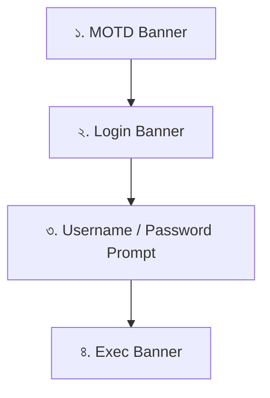

## ১. Hostname (হোস্টনেম)

ডিভাইসের পরিচয় নিশ্চিত করার জন্য আমরা `hostname` কমান্ড ব্যবহার করি। সিসকো ডিভাইস কেনার পর বাই ডিফল্ট তার নাম থাকে `Router>` বা `Switch>`। নেটওয়ার্কে যখন শত শত ডিভাইস থাকবে, তখন প্রম্পটে শুধু "Switch" লেখা থাকলে তুমি নিজেই ভুলে যাবে তুমি কোন সুইচে আছো!

* **কমান্ড ফ্লো:** গ্লোবাল কনফিগারেশন মোডে গিয়ে এই কমান্ড দিতে হয়।
```bash
Switch# configure terminal
Switch(config)# hostname Chicago
Chicago(config)#

```


দেখো, কমান্ডটি দেওয়ার সাথে সাথেই প্রম্পটের নাম `Switch` থেকে বদলে `Chicago` হয়ে গেছে।
* **১০০ IQ নেটওয়ার্কিং ট্রিক:** লেখক এখানে নিজের নাম 'Todd' দিয়ে ডিভাইস সেভ করলেও একটি দারুণ পরামর্শ দিয়েছেন—**ডিভাইসের নাম সবসময় তার ফিজিক্যাল লোকেশন (কোথায় রাখা আছে) অনুযায়ী দেওয়া উচিত।** যেমন: `Dhaka-Core-Router` বা `Floor3-Switch2`। এতে দূর থেকে (Remote লগইন করে) কাজ করার সময় ভুল ডিভাইসে কনফিগারেশন চেঞ্জ হয়ে যাওয়ার ঝুঁকি থাকে না।

---

## ২. Banners (ব্যানার)

ব্যানার হলো একটি নোটিশ বা বার্তা, যা কোনো ইউজার রাউটার বা সুইচে প্রবেশ করার চেষ্টা করলেই তার স্ক্রিনে ভেসে ওঠে।

### কেন ব্যানার দেওয়া জরুরি? (নিরাপত্তা ও আইনি কারণ)

ব্যানারের সবচেয়ে বড় কাজ হলো **অবৈধ ইউজারদের সতর্ক করা**। তুমি যদি ব্যানারে লিখে দাও—*"অনুমতি ছাড়া এখানে প্রবেশ করা সম্পূর্ণ নিষেধ এবং আইনত দণ্ডনীয়"*—তবে কোনো হ্যাকার হ্যাক করার চেষ্টা করলে পরবর্তীতে তার বিরুদ্ধে আইনি ব্যবস্থা নেওয়া সহজ হয়।

সিসকো ডিভাইসে মূলত ৩ ধরণের ব্যানার ব্যবহার করা হয়:

### ক) MOTD Banner (Message of the Day) — সবচেয়ে জনপ্রিয়

এটি সবচেয়ে বেশি ব্যবহৃত হয়। কনসোল পোর্ট, টেলনেট (Telnet), বা অক্সিলিয়ারি পোর্ট—যেকোনো রাস্তা দিয়েই কেউ ডিভাইসে কানেক্ট হতে গেলেই **সবার আগে** এই মেসেজটি স্ক্রিনে শো করবে।

* **Delimiting Character (ডিলিমিটিং ক্যারেক্টার):** ব্যানার লেখার সময় সিসকোকে বোঝাতে হয় যে মেসেজটি ঠিক কোথায় শুরু আর কোথায় শেষ। এর জন্য একটি বিশেষ চিহ্ন ব্যবহার করা হয়, যাকে বলে ডিলিমিটিং ক্যারেক্টার (যেমন: `#`, `x`, `&` ইত্যাদি)। তুমি শুরুতে যে চিহ্ন দেবে, মেসেজের শেষেও ঠিক সেই চিহ্ন দিয়ে শেষ করতে হবে।
* **কমান্ড উদাহরণ (মাল্টি-লাইন):**
```bash
Todd(config)# banner motd #
Enter TEXT message. End with the character '#'.
If you are not authorized, please disconnect immediately!
#
Todd(config)#

```


এখানে শুরুতে `#` দেওয়া হয়েছে, তারপর এন্টার দিয়ে মেসেজ লেখা হয়েছে, এবং সবশেষে আবার `#` দিয়ে এন্টার দেওয়া হয়েছে।
* **এক লাইনে লেখার ট্রিক:** তুমি চাইলে এক লাইনেও লিখে দিতে পারো এভাবে:
```bash
Todd(config)# banner motd x Unauthorized access prohibited! x

```


### খ) Login Banner (লগইন ব্যানার)

এই ব্যানারটি **MOTD ব্যানারের ঠিক পরে, কিন্তু ইউজারনেম-পাসওয়ার্ড চাওয়ার ঠিক আগে** স্ক্রিনে ভেসে ওঠে। এটি সাধারণত ডিভাইসের নিজস্ব কোনো গাইডলাইন বা ক্রেডেনশিয়াল চেঞ্জ করার নোটিশ দিতে ব্যবহৃত হয়। (যেমন সিসকোর নতুন রাউটারগুলোতে ডিফল্ট ইউজারনেম/পাসওয়ার্ড `cisco` পরিবর্তন করার জন্য ডিফল্ট একটা লগইন ব্যানার দেওয়াই থাকে)।

> **মনে রাখবে:** লগইন ব্যানার নির্দিষ্ট কোনো লাইনের জন্য বন্ধ করা যায় না। এটি বন্ধ করতে হলে গ্লোবাল মোড থেকে `no banner login` কমান্ড দিয়ে একবারে মুছে ফেলতে হয়।

### গ) Exec Banner (এক্সিক ব্যানার)

যখন কোনো ইউজার সফলভাবে লগইন প্রসেস বা VTY সেশন (Exec Process) চালু করে, ঠিক সেই মুহূর্তে এই ব্যানারটি দেখায়। ইউজার সেশন অ্যাক্টিভেট হওয়ার সাথে সাথেই এটি ট্রিগার হয়।

---

## ব্যানার প্রদর্শনের সঠিক ক্রম (Order of Appearance)

পরীক্ষায় এবং ইন্টারভিউতে এই সিকোয়েন্স বা ক্রমটি প্রায়ই জিজ্ঞেস করা হয়। কেউ যখন ডিভাইসে ঢোকার চেষ্টা করবে, তখন ব্যানারগুলো নিচের ক্রমানুসারে স্ক্রিনে আসবে:



---

## Summary Cheat Sheet (চটজলদি রিভিশন)

* **`hostname <নাম>`:** ডিভাইসের নাম পরিবর্তন করে (লোকালি কাজ করে)।
* **`banner motd <চিহ্ন> <মেসেজ> <চিহ্ন>`:** সবার আগে প্রদর্শিত হওয়া গ্লোবাল নোটিশ।
* **ডিলিমিটিং ক্যারেক্টার:** মেসেজের শুরু ও শেষ বোঝানোর সীমানা প্রাচীর (মেসেজের ভেতরে এই চিহ্নটি আর ব্যবহার করা যাবে না)।
* **ক্রম:** `MOTD` $\rightarrow$ `Login` $\rightarrow$ `Password Prompt` $\rightarrow$ `Exec`।

---

সিসকো ডিভাইসের সুরক্ষার সবচেয়ে বড় হাতিয়ার—**Setting Passwords (পাসওয়ার্ড সেট করা)**। বইয়ের এই অংশে সিসকো রাউটার বা সুইচকে হ্যাকার বা অননুমোদিত ইউজারদের হাত থেকে বাঁচাতে ৫ ধরণের পাসওয়ার্ডের কথা বলা হয়েছে।

এই পাসওয়ার্ডগুলোকে মূলত দুটি ভাগে ভাগ করা যায়:
১. **Privileged Mode-কে সুরক্ষিত করার পাসওয়ার্ড:** `enable password` এবং `enable secret`।
২. **User Mode বা ডিভাইসে ঢোকার রাস্তা সুরক্ষিত করার পাসওয়ার্ড:** `console`, `vty` (Telnet/SSH), এবং `auxiliary`।

চলো একদম ইন-DEPTH এবং সহজ বাংলায় প্রতিটি পাসওয়ার্ডের খুঁটিনাটি বুঝে নেওয়া যাক:

---

## ১. Privileged Mode সুরক্ষিত করার পাসওয়ার্ড (Enable Passwords)

যখন কেউ ইউজার মোড (`Router>`) থেকে প্রিভিলেজড মোডে (`Router#`) যাওয়ার জন্য `enable` কমান্ড দেবে, তখন তাকে আটকানোর জন্য এই পাসওয়ার্ডগুলো ব্যবহার করা হয়। গ্লোবাল কনফিগারেশন মোডে গিয়ে `enable ?` চাপলে ৪টি অপশন দেখা যায়:

* **`enable secret` (সবচেয়ে গুরুত্বপূর্ণ ও আধুনিক):** এটি একটি হাইলি এনক্রিপ্টেড (লুকানো) পাসওয়ার্ড। রাউটারের কনফিগারেশন ফাইলের ভেতর এই পাসওয়ার্ডটি সরাসরি দেখা যায় না, বরং কিছু অদ্ভুত কোড হিসেবে থাকে (যেমন MD5 বা SHA এনক্রিপশন)। সিকিউরিটির জন্য সবসময় এটিই ব্যবহার করা উচিত।
* **`enable password` (পুরোনো বা লেগাসি):** এটি পুরোনো সিসকো সিস্টেমে (IOS 10.3 এর আগে) ব্যবহৃত হতো। এর বড় সমস্যা হলো, এটি **Plain Text** বা একদম সরাসরি কনফিগারেশন ফাইলে দেখা যায়। যে কেউ কনফিগারেশন ফাইল দেখতে পারলে এই পাসওয়ার্ডটি চুরি করে নিতে পারবে।
* **`last-resort`:** নেটওয়ার্কে যদি কোনো কারণে কেন্দ্রীয় পাসওয়ার্ড ভেরিফিকেশন সার্ভার (TACACS) ডাউন হয়ে যায়, তখন এই অপশনটি ব্যবহার করে ব্যাকআপ হিসেবে ডিভাইসে ঢোকা যায়।
* **`use-tacacs`:** এটি রাউটারকে নির্দেশ দেয় পাসওয়ার্ডটি নিজে চেক না করে কোম্পানির সেন্ট্রাল **TACACS Server** থেকে ভেরিফাই করতে। তোমার যদি ১০০টা রাউটার থাকে, তবে প্রতিটাতে আলাদা করে পাসওয়ার্ড চেঞ্জ করা অসম্ভব। এই সার্ভার থাকলে এক জায়গায় পাসওয়ার্ড চেঞ্জ করলেই সব রাউটারে সেটি আপডেট হয়ে যায়।

### সিসকোর একটি মজার সতর্কবার্তা

তুমি যদি ভুল করে `enable secret` এবং `enable password` দুটিই একই দাও (যেমন টেক্সটে দুটির পাসওয়ার্ডই `todd` দেওয়া হয়েছে), তবে সিসকো তোমাকে ভদ্রভাবে একটি ওয়ার্নিং মেসেজ দেবে:

```text
The enable password you have chosen is the same as your enable secret. This is not recommended.

```

> **১০০ IQ নিয়ম:** সিসকো ডিভাইসে যদি `enable secret` এবং `enable password` দুটিই সেট করা থাকে, তবে ডিভাইসটি সবসময় **`enable secret`**-কে অগ্রাধিকার দেবে। পুরোনো যুগের রাউটার না থাকলে রিয়েল-লাইফে নেটওয়ার্ক ইঞ্জিনিয়াররা `enable password` কমান্ডটি ব্যবহারই করে না, সরাসরি `enable secret` ব্যবহার করে।

---

## ২. User Mode বা প্রবেশের রাস্তা সুরক্ষিত করার পাসওয়ার্ড (Line Passwords)

রাউটার বা সুইচের ভেতর একদম শুরুতে পা রাখার জন্য ৩টি ভিন্ন ভিন্ন রাস্তা (Line) আছে। এই রাস্তাগুলো লক করতে গ্লোবাল মোড থেকে `line` কমান্ড ব্যবহার করতে হয়:

### ক) Console Password (`line console 0`)

* **কাজ:** রাউটারের ফিজিক্যাল কনসোল পোর্টে সরাসরি ক্যাবল লাগিয়ে যখন কোনো ইঞ্জিনিয়ার কাজ করতে বসবে, তখন এই পাসওয়ার্ডটি চাওয়া হবে।
* **কনফিগারেশন:**
```bash
Todd(config)# line console 0
Todd(config-line)# password 1234
Todd(config-line)# login

```


> **মনে রাখবে:** পাসওয়ার্ড লেখার পর এই **`login`** কমান্ডটি দেওয়া বাধ্যতামূলক! তুমি যদি শুধু পাসওয়ার্ড দাও কিন্তু `login` না লেখো, তবে সিসকো ডিভাইস কাউকে পাসওয়ার্ড জিজ্ঞেসই করবে না।


### খ) VTY (Virtual Terminal) Password (`line vty 0 4`)

* **কাজ:** দূর থেকে নেটওয়ার্কের মাধ্যমে **Telnet** বা **SSH** ব্যবহার করে রাউটারে লগইন করার রাস্তা হলো VTY। এখানে `0 4` মানে হলো একই সাথে ৫ জন ইউজার (০ থেকে ৪ পর্যন্ত) আলাদা আলাদাভাবে রাউটারে রিমোটলি ঢুকতে পারবে।
* **পরীক্ষার জন্য অত্যন্ত গুরুত্বপূর্ণ টিপস:** সিসকো ডিভাইসের একটি ডিফল্ট সিকিউরিটি মেকানিজম আছে—**তুমি যদি VTY পাসওয়ার্ড সেট না করো, তবে সিসকো ডিভাইস নেটওয়ার্কের মাধ্যমে কাউকেই Telnet করতে দেবে না!** Telnet করতে গেলেই এরর দেখাবে। তাই দূর থেকে অ্যাক্সেস করার জন্য VTY পাসওয়ার্ড এবং `login` কমান্ড দেওয়া মাস্ট।

### গ) Auxiliary (AUX) Password (`line aux 0`)

* **কাজ:** এটি মূলত পুরোনো যুগে মডেমের মাধ্যমে দূরবর্তী কোনো টেলিফোন লাইন দিয়ে রাউটারে কানেক্ট হওয়ার জন্য ব্যবহার করা হতো। বর্তমানে এর ব্যবহার নেই বললেই চলে, তবে কনসোলের মতোই এটিকেও পাসওয়ার্ড দিয়ে লক করা যায়।

---

## ৫টি পাসওয়ার্ডের Cheat Sheet (এক নজরে মনে রাখার বুদ্ধি)

| পাসওয়ার্ডের নাম | কোন মোডে বাধা দেয়? | কীভাবে কনফিগার করতে হয়? | এনক্রিপশন স্ট্যাটাস |
| --- | --- | --- | --- |
| **`enable secret`** | Privileged Mode (`#`) | `enable secret <পাসওয়ার্ড>` | **Encypted** (সুরক্ষিত ও গোপন) |
| **`enable password`** | Privileged Mode (`#`) | `enable password <পাসওয়ার্ড>` | **Clear Text** (অসুরক্ষিত, দেখা যায়) |
| **`console`** | User Mode (`>`) - ক্যাবলের মাধ্যমে | `line console 0` $\rightarrow$ `password` $\rightarrow$ `login` | ডিফল্টভাবে আন-এনক্রিপ্টেড |
| **`vty`** | User Mode (`>`) - দূর থেকে (Telnet) | `line vty 0 4` $\rightarrow$ `password` $\rightarrow$ `login` | ডিফল্টভাবে আন-এনক্রিপ্টেড |
| **`aux`** | User Mode (`>`) - মডেমের মাধ্যমে | `line aux 0` $\rightarrow$ `password` $\rightarrow$ `login` | ডিফল্টভাবে আন-এনক্রিপ্টেড |

পরবর্তী পার্টে লেখক দেখাবেন কীভাবে এই ইন্ডিভিজুয়াল লাইনগুলো আরও নিখুঁতভাবে কনফিগার করা যায় এবং এই আন-এনক্রিপ্টেড লাইন পাসওয়ার্ডগুলোকে কীভাবে একটা গ্লোবাল কমান্ড দিয়ে এনক্রিপ্ট করে ফেলা যায়।

---

সিসকো ডিভাইসের **Console Port**-এর ভেতরের কিছু অ্যাডভান্সড কনফিগারেশন এবং মজার ট্রিকস নিয়ে বইয়ের এই অংশে আলোচনা করা হয়েছে। এখানে ৩টি মূল জিনিস শেখানো হয়েছে: **১. প্রম্পটের ভেতরের এক অদ্ভুত বিহেভিয়ার (The Help Feature bug/feature), ২. সেশন বন্ধ হওয়া আটকানো (`exec-timeout`), এবং ৩. স্ক্রিনের ডিস্টার্বিং মেসেজ ঠিক করা (`logging synchronous`)।**

চলো প্রতিটা পয়েন্ট ইন-DEPTH এবং সহজ বাংলায় ভেঙে বুঝে নিই:

---

## ১. প্রম্পটের ভেতরের অদ্ভুত "Feature"

লেখক শুরুতেই একটা মজার ট্রিক দেখিয়েছেন। তুমি যখন অলরেডি লাইনের ভেতরে আছো (প্রম্পট: `Todd(config-line)#`), তখন যদি তুমি আবার `line console ?` লিখে হেল্প চাও, সিসকো তোমাকে `% Unrecognized command` এরর দেখাবে।

* **কেন এমন হয়?** সিসকোর CLI-তে তুমি যখন একটি নির্দিষ্ট সাব-মোডে ঢুকে যাও, তখন সেখান থেকে সরাসরি অন্য সাব-মোডের জন্য `?` (Help) স্ক্রিন কাজ করে না।
* **সমাধান:** তোমাকে প্রথমে `exit` লিখে এক ধাপ পেছনে (গ্লোবাল মোডে) আসতে হবে। তারপর `line console ?` চাপলে এটি ঠিকঠাক কাজ করবে। লেখক মজা করে একে সিসকোর একটি "Feature" বলেছেন!
* **মনে রাখবে:** রাউটার বা সুইচে ফিজিক্যাল কনসোল পোর্ট একটাই থাকে, তাই কমান্ডটি সবসময় হবে **`line console 0`** (০ নম্বর পোর্ট)।

---

## ২. `exec-timeout` কমান্ড (সেশন টাইম-আউট কন্ট্রোল)

বাই ডিফল্ট (Default), তুমি যদি রাউটারে কনসোল ক্যাবল দিয়ে লগইন করে **১০ মিনিট** কিবোর্ডে কোনো হাত না দিয়ে চুপচাপ বসে থাকো, তবে রাউটার সিকিউরিটির জন্য তোমাকে অটোমেটিক লগআউট (Kick out) করে দেবে। আবার পাসওয়ার্ড দিয়ে ঢুকতে হবে।

ল্যাবে প্র্যাকটিস করার সময় বারবার লগআউট হয়ে যাওয়াটা খুবই বিরক্তিকর। এটি বন্ধ করার কমান্ড হলো:

```bash
Todd(config-line)# exec-timeout 0 0

```

এখানে প্রথম `0` হলো মিনিট এবং দ্বিতীয় `0` হলো সেকেন্ড। **`0 0` মানে হলো "Never Timeout" (কখনোই সেশন বন্ধ হবে না)**। তুমি ১০ দিন পর এসেও দেখবে রাউটার লগইন অবস্থাতেই আছে।

### সহকর্মীদের সাথে দুষ্টুমি করার ট্রিক (Prank Trick)

লেখক একটি মজার দুষ্টু বুদ্ধির কথা বলেছেন। তুমি যদি অফিসে তোমার কোনো কলিগের রাউটারে গিয়ে কমান্ড দাও:

```bash
Todd(config-line)# exec-timeout 0 1

```

এর মানে হলো টাইম-আউট **১ সেকেন্ড**! এন্টার দেওয়ার সাথে সাথেই সে লগআউট হয়ে যাবে। এরপর সে যতবারই পাসওয়ার্ড দিয়ে ঢুকবে, ১ সেকেন্ডের মধ্যে আবার কিক আউট খাবে! এটা ঠিক করার একমাত্র উপায় হলো—এক হাত দিয়ে কিবোর্ডের নিচের তীর চিহ্ন (`Down Arrow`) অনবরত চাপতে থাকা (যেন রাউটার মনে করে ইউজার অ্যাক্টিভ আছে) আর অন্য হাত দিয়ে দ্রুত কমান্ডটি টাইপ করে `exec-timeout 0 0` বা বড় কোনো সংখ্যায় বদলে দেওয়া!

---

## ৩. `logging synchronous` (বিরক্তিকর নোটিফিকেশন থেকে মুক্তি)

সিসকো রাউটারে কাজ করার সময় ব্যাকগ্রাউন্ডে নানা ধরণের সিস্টেম মেসেজ (যেমন: কোনো ইন্টারফেস আপ বা ডাউন হলে লোগো মেসেজ) স্ক্রিনে ভেসে ওঠে।

সবচেয়ে বিরক্তিকর ব্যাপার হলো, তুমি যখন টাইপ করছ: `Switch(config)# interface fastEthernet 0/1`—ঠিক মাঝপথে যদি একটা সিস্টেম মেসেজ এসে পড়ে, তবে তোমার টাইপ করা কমান্ডটি ভেঙে দুই টুকরো হয়ে যায়। লেখাটি দেখতে এমন হয:

```bash
Switch(config)# interface fastEt
00:19:55: %LINK-3-UPDOWN: Interface FastEthernet0/1, changed state to up
hernet 0/1

```

এতে বোঝা যায় না তুমি আসলে কী টাইপ করছ, ব্যাকস্পেস চাপতেও সমস্যা হয়।

* **সমাধান:** এই সমস্যার একমাত্র জাদুকরী ওষুধ হলো **`logging synchronous`** কমান্ড।
```bash
Todd(config-line)# logging synchronous

```


* **এটি কী করে?** এই কমান্ডটি দিলে সিস্টেম মেসেজ ঠিকই আসবে, কিন্তু আসার পর সিসকো তোমার টাইপ করা অর্ধেক কমান্ডটিকে স্বয়ংক্রিয়ভাবে একটি নতুন লাইনে সুন্দর করে সাজিয়ে ফিরিয়ে দেবে। তোমার টাইপিংয়ে কোনো ব্যাঘাত ঘটবে না! এটি কাজকে অনেক সহজ ও দৃষ্টিনন্দন করে তোলে।

---

## 100 IQ Summary (এক নজরে কি-পয়েন্টস)

* **`line console 0`**: কনসোল লাইনে ঢোকার মেইন কমান্ড।
* **`password <পাসওয়ার্ড>` এবং `login**`: কনসোলে পাসওয়ার্ড লক অ্যাক্টিভেট করার জন্য এই দুটি কমান্ড পর পর দিতেই হবে।
* **`exec-timeout 0 0`**: অটো-লগআউট বন্ধ করে দেয় (ডিফল্ট থাকে ১০ মিনিট)।
* **`logging synchronous`**: সিস্টেম নোটিফিকেশনের কারণে টাইপিং কমান্ড ভেঙে যাওয়া রোধ করে স্ক্রিন পরিষ্কার রাখে।

ল্যাব কনফিগার করার সময় প্রতিটা ডিভাইসে `line console 0` এর ভেতর ঢুকে এই দুটি কমান্ড (`exec-timeout 0 0` এবং `logging synchronous`) দেওয়া সিসকো ইঞ্জিনিয়ারদের একটা স্ট্যান্ডার্ড অভ্যাস বা বেস্ট প্র্যাকটিস।

---

সিসকো ডিভাইসের রিমোট ম্যানেজমেন্টের জন্য সবচেয়ে গুরুত্বপূর্ণ দুটি লাইন—**Telnet (VTY) Password** এবং **Auxiliary (AUX) Password** নিয়ে এখন আমরা আলোচনা করব।

আগের পার্টগুলোতে আমরা ফিজিক্যাল কনসোল ক্যাবল দিয়ে ডিভাইসের সামনে বসে কাজ করা শিখেছি। কিন্তু বাস্তবে, এসি রুমে রাখা সুইচের সামনে গিয়ে প্রতিদিন ক্যাবল গোঁজা সম্ভব নয়। তাই আমরা দূর থেকে (Network-এর মাধ্যমে) রাউটার/সুইচ কনফিগার করার জন্য **Telnet** ব্যবহার করি।

চলো একদম ইন-DEPTH এবং সহজ বাংলায় টপিকগুলো বুঝে নিই:

---

## ১. Telnet Password (`line vty`)

সিসকো ডিভাইসে দূর থেকে নেটওয়ার্কের মাধ্যমে লগইন করার ভার্চুয়াল রাস্তাকে বলা হয় **VTY (Virtual Terminal)**।

* **লাইনের সংখ্যা (Lines):** সিসকো সুইচে সাধারণত ১৬টি ভার্চুয়াল লাইন থাকে (নাম্বারিং শুরু হয় `0` থেকে, তাই `0` থেকে `15`)। এর মানে হলো, একই সাথে সর্বোচ্চ ১৬ জন ইঞ্জিনিয়ার আলাদা আলাদা পিসি থেকে ওই সুইচে লগইন করে কাজ করতে পারবেন।
* **হেল্প স্ক্রিনের সেই চিরচেনা "Feature":** আগের মতোই, তুমি যদি অলরেডি কোনো লাইনের ভেতর থাকো (`Todd(config-line)#`), তবে সেখান থেকে `line vty ?` দিলে এরর দেখাবে। তোমাকে `exit` দিয়ে গ্লোবাল মোডে এসে হেল্প চাইতে হবে।

### কনফিগারেশন ফ্লো:

```bash
Todd(config)# line vty 0 15
Todd(config-line)# password telnet
Todd(config-line)# login

```

এখানে `line vty 0 15` লিখে আমরা ১৬টি লাইন একসাথে সিলেক্ট করলাম। তারপর পাসওয়ার্ড সেট করে `login` কমান্ড দিলাম।

### সিসকোর "Password required, but none set" এরর

সিসকো ডিভাইসের একটি চরম সিকিউরিটি মেকানিজম আছে। তুমি যদি ডিভাইসে আইপি অ্যাড্রেস বসাও কিন্তু এই VTY পাসওয়ার্ড সেট না করো, তবে দূর থেকে কেউ Telnet করতে গেলে কানেকশনটি কেটে যাবে এবং এই এররটি দেখাবে:

```text
Password required, but none set
[Connection to SwitchB closed by foreign host]

```

> **এর মানে কী?** সিসকো ডিভাইস বলছে—"তুমি দূর থেকে আমার ভেতর ঢুকতে চাচ্ছো, অথচ সুরক্ষার জন্য কোনো পাসওয়ার্ডই সেট করোনি! তাই সিকিউরিটির স্বার্থে আমি তোমাকে ঢুকতে দেব না।"

### ১০০ IQ হ্যাক: পাসওয়ার্ড ছাড়া ঢোকার ট্রিক (no login)

তুমি যদি চাও কোনো পাসওয়ার্ড ছাড়াই যে কেউ যেন Telnet করে ডিভাইসে ঢুকে যেতে পারে, তবে কমান্ড দিতে হবে:

```bash
SwitchB(config-line)# line vty 0 15
SwitchB(config-line)# no login

```

`no login` মানে হলো—"আমার কোনো পাসওয়ার্ড চেকিংয়ের দরকার নেই, যে আসবে তাকেই ঢুকতে দাও।"

* **সতর্কতা:** লেখক কড়াভাবে সতর্ক করেছেন যে, এটি শুধুমাত্র ল্যাব বা ক্লাসরুমে টেস্টিংয়ের জন্য ঠিক আছে। রিয়েল-লাইফ করপোরেট নেটওয়ার্কে ভুলেও এটি করবে না, কারণ পাসওয়ার্ড ছাড়া নেটওয়ার্কের ডিভাইস উন্মুক্ত রাখলে হ্যাকাররা পুরো নেটওয়ার্ক ধ্বংস করে দিতে পারে!

---

## ২. Auxiliary Password (`line aux 0`)

Auxiliary (AUX) পোর্টটি মূলত রাউটারের পেছনে থাকে (সুইচে এই পোর্ট থাকে না)।

* **কাজ:** এটি ওল্ড-স্কুল বা পুরোনো যুগের প্রযুক্তি। যখন মেইন ইন্টারনেট বা লোকাল নেটওয়ার্ক একদম ডাউন হয়ে যেত, তখন এই পোর্টের সাথে একটি এক্সটার্নাল **Modem** এবং টেলিফোন লাইন যুক্ত করা হতো। ইঞ্জিনিয়াররা দূর থেকে ওই টেলিফোন নাম্বারে ডায়াল করে রাউটারের কমান্ড লাইনে অ্যাক্সেস পেতেন।
* **লাইনের সংখ্যা:** কনসোলের মতো এটিও রাউটারে একটাই থাকে, তাই কমান্ড হবে **`line aux 0`**।

### সিসকোর আরেকটি সিকিউরিটি গার্ডরেল (ভুল ধরার চমৎকার উদাহরণ):

টেক্সটের এই অংশটি ভালো করে লক্ষ্য করো:

```bash
Todd(config-line)# line aux 0
Todd(config-line)# login
% Login disabled on line 1, until 'password' is set

```

তুমি যদি পাসওয়ার্ড না লিখে আগেই `login` কমান্ড দিতে যাও, সিসকো তোমাকে আটকে দেবে এবং বলবে—"পাসওয়ার্ড সেট না করা পর্যন্ত এই লাইনে লগইন অপশন অ্যাক্টিভেট করা যাবে না।"

তাই সঠিক নিয়ম হলো: **আগে পাসওয়ার্ড সেট করবে, তারপর `login` কমান্ড দেবে।**

```bash
Todd(config-line)# password aux
Todd(config-line)# login

```

---

## Summary Cheat Sheet (টেলনেট ও অক্সিলিয়ারি)

* **`line vty 0 15`**: সুইচের ১৬টি রিমোট অ্যাক্সেস লাইন একসাথে কনফিগার করার কমান্ড।
* **পাসওয়ার্ড ছাড়া টেলনেট**: `no login` কমান্ড দিয়ে করা যায় (অত্যন্ত বিপজ্জনক!)।
* **`line aux 0`**: রাউটারের ব্যাকআপ মডেম লাইনের সিকিউরিটি সেটআপ (সুইচে এটি থাকে না)।
* **স্বর্ণালী নিয়ম**: সিসকো লাইনে সিকিউরিটি চালু করতে হলে আগে টাইপ করো `password <text>`, তারপর টাইপ করো `login`।

ভার্চুয়াল লাইন (VTY) এবং টেলনেটের এই কনসেপ্টটি নেটওয়ার্কিংয়ের জন্য বেসিক পিলার। এর পরবর্তী চ্যাপ্টারগুলোতে আমরা দেখব কীভাবে আরও সিকিউরড মাধ্যম **SSH (Secure Shell)** কনফিগার করতে হয়, যেখানে পাসওয়ার্ড বাতাসে এনক্রিপ্ট হয়ে চলাচল করে।

---

আমরা গত পর্বে জেনেছিলাম নেটওয়ার্কের মাধ্যমে দূর থেকে ডিভাইসে ঢোকার জন্য Telnet ব্যবহার করা হয়। কিন্তু টেক্সটের শুরুতেই লেখক একটি মারাত্মক বিপদের কথা বলেছেন—**Telnet-এর ডাটা স্ট্রিম আন-এনক্রিপ্টেড (Plain Text)**। অর্থাৎ, তুমি যখন Telnet দিয়ে লগইন করবে, তখন তোমার ইউজারনেম আর পাসওয়ার্ড বাতাসে একদম খোলা চিঠির মতো ভেসে যাবে। নেটওয়ার্কে ওত পেতে থাকা যেকোনো হ্যাকার `Wireshark`-এর মতো সফটওয়্যার দিয়ে সহজেই তোমার পাসওয়ার্ড চুরি করে নিতে পারবে।

এই সমস্যার একমাত্র এবং চূড়ান্ত সমাধান হলো **Secure Shell (SSH)**। SSH তোমার পাসওয়ার্ড এবং সব ডেটাকে **Encryption Keys** (কিপ্টোগ্রাফিক চাবি) দিয়ে এমনভাবে লক বা কোড করে পাঠায় যে, মাঝখান থেকে কেউ ডাটা চুরি করলেও তা পড়তে পারবে না।

সিসকো ডিভাইসে SSH সেটআপ করার মোট **৮টি ধাপ** আছে। চলো প্রতিটি ধাপ একদম ইন-DEPTH এবং সহজ বাংলায় ভেঙে বুঝে নিই:

---

## SSH কনফিগার করার ৮টি জাদুকরী ধাপ

### ধাপ ১: Hostname সেট করা

ডিভাইসের নিজস্ব একটা নাম থাকতে হবে (কারণ ডিফল্ট `Router` বা `Switch` নাম দিয়ে এনক্রিপশন চাবি বানানো যায় না)।

```bash
Router(config)# hostname Todd

```

### ধাপ ২: Domain Name সেট করা

এনক্রিপশন চাবি তৈরি করার জন্য সিসকোর একটি ফর্মুলা আছে। সে ডিভাইসের `Hostname` এবং `Domain Name` দুটোকে একসাথে জোড়া লাগিয়ে চাবির আসল নাম বা ID তৈরি করে (যেমন: `Todd.Lammle.com`)। তাই ডোমেন নেম দেওয়া বাধ্যতামূলক।

```bash
Todd(config)# ip domain-name Lammle.com

```

### ধাপ ৩: Local Username & Password তৈরি করা

Telnet-এ আমরা শুধু একটা সাধারণ পাসওয়ার্ড দিয়ে ঢুকে যেতাম। কিন্তু SSH-এ প্রফেশনাল সিকিউরিটির জন্য নির্দিষ্ট **ইউজারনেম (Username)** এবং **পাসওয়ার্ড (Password)** দুটোই লাগে।

```bash
Todd(config)# username Todd password Lammle

```

### ধাপ ৪: Encryption Keys তৈরি করা (Crypto Key)

এটি হলো আসল ম্যাজিক লাইন। এখানে আমরা রাউটারকে বলছি ডাটা লক করার জন্য **RSA** অ্যালগরিদমের ক্রিপ্টোগ্রাফিক চাবি তৈরি করতে।

```bash
Todd(config)# crypto key generate rsa

```

কমান্ডটি দেওয়ার পর রাউটার তোমাকে জিজ্ঞেস করবে—চাবিটি কত বড় বা কত বিটের হবে (`How many bits in the modulus`)? রেঞ্জ হলো ৩৬০ থেকে ৫০৯৫ বিট।

* **১০০ IQ নেটওয়ার্কিং ট্রিক:** সিসকোতে SSH Version 2 চালু করতে হলে এই চাবির সাইজ সর্বনিম্ন **৭৬৮ বিট** বা তার বেশি হতে হবে। টেক্সটে ইঞ্জিনিয়ার **১০২৪ বিট** (`1024`) দিয়ে এন্টার দিয়েছেন, যা অত্যন্ত শক্তিশালী এবং সুরক্ষিত। চাবি তৈরি হয়ে গেলে স্ক্রিনে নোটিফিকেশন আসবে: `%SSH-5-ENABLED: SSH 1.99 has been enabled`.

### ধাপ ৫: SSH Version 2 চালু করা (ঐচ্ছিক কিন্তু অত্যন্ত জরুরি)

SSH-এর দুটি ভার্সন আছে—Version 1 এবং Version 2। Version 1-এ কিছু সিকিউরিটি দুর্বলতা আছে, তাই রিয়েল-লাইফে আমরা সবসময় ভার্সন ২ ব্যবহার করি।

```bash
Todd(config)# ip ssh version 2

```

### ধাপ ৬: VTY লাইনে প্রবেশ করা

দূর থেকে ঢোকার জন্য সুইচের ১৬টি ভার্চুয়াল লাইন (`vty 0 15`) সিলেক্ট করতে হবে।

```bash
Todd(config)# line vty 0 15
Todd(config-line)#

```

### ধাপ ৭: Local Database ব্যবহার করতে বলা (`login local`)

আগের চ্যাপ্টারে আমরা শুধু `login` লিখেছিলাম। কিন্তু এখন আমরা লিখব **`login local`**।

* **এর মানে কী?** রাউটারকে বলে দেওয়া হচ্ছে—"এখন থেকে বাইরে থেকে কেউ যখন ঢুকতে চাইবে, তুমি শুধু পাসওয়ার্ড খুঁজবে না; বরং একটু আগে ধাপ ৩-এ আমরা রাউটারের নিজস্ব মেমোরিতে (Local Database) যে ইউজারনেম (`Todd`) আর পাসওয়ার্ড (`Lammle`) সেভ করেছি, সেটার সাথে মিলিয়ে দেখবে।"

### ধাপ ৮: Access Protocol বা ট্রাফিক কন্ট্রোল করা

এই লাইনটি খুবই সেনসিটিভ। বাইরে থেকে কোন প্রোটোকল ব্যবহার করে লোক লাইনে ঢুকতে পারবে, তা আমরা `transport input` কমান্ড দিয়ে নিয়ন্ত্রণ করি।

* **ভয়ংকর ভুল (`transport input all`):** তুমি যদি এটি দাও, তবে Telnet, SSH সহ সব আন-সেসিকউরড প্রোটোকল ওপেন হয়ে যাবে। করপোরেট নেটওয়ার্কে এটি করা মানে হ্যাকারদের দাওয়াত দেওয়া!
* **বেস্ট প্র্যাকটিস ও নিরাপদ উপায় (`transport input ssh`):**
```bash
Todd(config-line)# transport input ssh

```


এই কমান্ডটি দেওয়ার সাথে সাথে **Telnet চিরতরে ব্লক হয়ে যাবে!** এখন কেউ যদি Telnet দিয়ে ঢোকার চেষ্টা করে, রাউটার তাকে লাথি মেরে বের করে দেবে। শুধুমাত্র SSH দিয়ে সিকিউরড উপায়ে ঢোকা যাবে।
* **ব্যাকআপ অপশন (`transport input ssh telnet`):** যদি তোমার কোনো বিশেষ কারণে টেলনেটও চালু রাখতে হয়, তবে দুটোর নামই পাশাপাশি লিখে দিতে পারো। তবে সিকিউরিটির জন্য শুধু `ssh` রাখাটাই বুদ্ধিমানের কাজ।

---

## 100 IQ Summary (SSH Cheat Sheet)

* **Telnet বনাম SSH:** Telnet হলো খোলা চিঠি (Unencrypted), আর SSH হলো সিন্দুকের ভেতর লক করা চিঠি (Encrypted)।
* **চাবি তৈরির সূত্র:** Hostname + Domain Name = SSH Key Name.
* **`login local`:** রাউটারের ভেতরের নিজস্ব ইউজারনেম-পাসওয়ার্ড দিয়ে লগইন ভেরিফাই করার জাদুকরী কমান্ড।
* **`transport input ssh`:** টেলনেটের দরজা চিরতরে বন্ধ করে শুধু SSH-এর জন্য রাস্তা উন্মুক্ত করার ফিল্টার।

---

সিসকো ডিভাইসের সুরক্ষার আরেকটি জাদুকরী অধ্যায়—**Encrypting Your Passwords (পাসওয়ার্ড এনক্রিপশন বা লক করা)**।

আগের চ্যাপ্টারগুলোতে আমরা দেখেছিলাম যে, `enable secret` ছাড়া অন্য সব পাসওয়ার্ড (যেমন- `enable password`, `console password`, `vty telnet password`) কনফিগারেশন ফাইলের ভেতর একদম প্লেইন টেক্সট বা সরাসরি দেখা যায়।

ধরো, তুমি রাউটারের সামনে বসে কাজ করছ আর স্ক্রিনে `show running-config` দিলে। তোমার পাশে যদি কোনো সাধারণ মানুষ বা হ্যাকার দাঁড়িয়ে থাকে, সে এক নজরেই স্ক্রিন দেখে তোমার সব পাসওয়ার্ড চুরি করে নেবে! তোমার দেওয়া টেক্সটের প্রথম `show run` আউটপুটটি লক্ষ্য করো:

* `enable password todd` (সরাসরি পাসওয়ার্ড দেখা যাচ্ছে!)
* `password console` (কনসোলের পাসওয়ার্ডও হাঁ করে তাকিয়ে আছে!)

এই মারাত্মক সিকিউরিটি রিস্ক থেকে বাঁচার উপায় হলো সিসকোর একটি বিশেষ গ্লোবাল কমান্ড: **`service password-encryption`**। চলো এটি কীভাবে কাজ করে তা একদম ইন-DEPTH এবং সহজ বাংলায় বুঝে নিই:

---

## ১. পাসওয়ার্ড এনক্রিপশন কীভাবে অন করবে?

সব পাসওয়ার্ডকে এক ক্লিকে কোড বা এনক্রিপ্টেড ফরম্যাটে রূপান্তর করতে গ্লোবাল কনফিগারেশন মোডে গিয়ে এই কমান্ডটি দিতে হয়:

```bash
Todd# config terminal
Todd(config)# service password-encryption

```

এই কমান্ডটি দেওয়ার পর তুমি যখন আবার কনফিগারেশন ফাইল চেক করবে (`show running-config`), তখন দেখবে অলৌকিক কাণ্ড! তোমার পাসওয়ার্ডগুলো আর চেনা যাচ্ছে না। টেক্সটের দ্বিতীয় আউটপুটটি দেখো:

* `enable password 7 1505050800`
* `password 7 050809013253520C`

এখানে সিসকো তোমার দেওয়া পাসওয়ার্ডগুলোকে **Type 7 Encryption** নামের একটি অ্যালগরিদম দিয়ে হিজিবিজি কোডে রূপান্তর করে ফেলেছে। এখন কেউ তোমার স্ক্রিনের দিকে তাকিয়ে থাকলেও পাসওয়ার্ড বুঝতে পারবে না।

---

## ২. টাইপ ৫ (Type 5) বনাম টাইপ ৭ (Type 7) পাসওয়ার্ডের পার্থক্য

আউটপুটে খেয়াল করলে দেখবে, দুই জায়গায় দুই রকম নাম্বার দেখাচ্ছে:

* `enable secret 5 ...` $\rightarrow$ এখানে **`5`** এর মানে হলো এটি **Type 5 (MD5)** অত্যন্ত শক্তিশালী এনক্রিপশন। এটি ভাঙা বা ডিক্রিপ্ট করা প্রায় অসম্ভব। সিসকো ডিভাইসে এটি ডিফল্টভাবেই থাকে।
* `enable password 7 ...` $\rightarrow$ এখানে **`7`** এর মানে হলো এটি **Type 7** এনক্রিপশন।

> **১০০ IQ সতর্কবার্তা:** এই টাইপ ৭ এনক্রিপশন কিন্তু খুব একটা শক্তিশালী নয়। গুগলে "Cisco Type 7 Decrypter" লিখে সার্চ করলে এক সেকেন্ডেই এই কোড থেকে আসল পাসওয়ার্ড বের করে ফেলা যায়। তবে এটি দেওয়ার মূল উদ্দেশ্য হলো—**"Over-the-shoulder security"**, অর্থাৎ কেউ যেন তোমার পাশে দাঁড়িয়ে সরাসরি স্ক্রিনের দিকে তাকিয়ে থেকে পাসওয়ার্ড মুখস্থ করতে না পারে।

---

## ৩. লেখকের একটি দারুণ এবং জটিল ট্রিক (The On/Off Logic)

টেক্সটের এই অংশটি অনেকের কাছে একটু কনফিউজিং লাগতে পারে, চলো সহজ করে দিই। লেখক বলেছেন, তুমি চাইলে এই সার্ভিসটি অন করে, ফাইলটি একবার দেখে (`show run`), আবার এটি বন্ধও করে দিতে পারো:

```bash
Todd(config)# no service password-encryption

```

**প্রশ্ন হলো: বন্ধ করে দিলে কি পাসওয়ার্ড আবার আগের মতো খোলা হয়ে যাবে?**

* **উত্তর:** না! তুমি একবার `service password-encryption` অন করার সাথে সাথে মেমোরিতে থাকা সব পাসওয়ার্ড চিরতরে এনক্রিপ্ট হয়ে লক হয়ে গেছে। এখন তুমি যদি `no service password-encryption` দিয়ে সার্ভিসটি বন্ধও করে দাও, আগের পাসওয়ার্ডগুলো কিন্তু কোড অবস্থাতেই (Locked) থেকে যাবে।
* **তাহলে বন্ধ কেন করব?** যদি তোমার সুইচে প্রসেসর বা র‍্যাম কম থাকে (ওল্ড মডেলের ডিভাইস), তবে ব্যাকগ্রাউন্ডে এই সার্ভিসটি অনবরত চালু রাখলে ডিভাইসের ওপর চাপ পড়ে। তাই ইঞ্জিনিয়াররা এটি অন করে পাসওয়ার্ড লক করে দিয়ে আবার বন্ধ করে দেয়।
* **নতুন পাসওয়ার্ডের ক্ষেত্রে কী হবে?** সার্ভিসটি বন্ধ করে দেওয়ার পর তুমি যদি আবার নতুন কোনো পাসওয়ার্ড সেট করো, সেই নতুন পাসওয়ার্ডটি কিন্তু আবার প্লেইন টেক্সট (অসুরক্ষিত) হিসেবে সেভ হবে। তাই বেস্ট প্র্যাকটিস হলো—রিয়েল-লাইফে এই কমান্ডটি সবসময় **অন (`service password-encryption`)** রাখাই সবচেয়ে নিরাপদ।

---

## Summary Cheat Sheet (পাসওয়ার্ড এনক্রিপশন)

* **বিপদ:** `enable password` এবং `line passwords` বাই ডিফল্ট ফাইলে সরাসরি দেখা যায়।
* **সমাধান:** `service password-encryption` কমান্ড দিলে সব পাসওয়ার্ড টাইপ ৭ কোডে রূপান্তরিত হয়।
* **Type 5 vs 7:** টাইপ ৫ (Secret) সুপার স্ট্রং, টাইপ ৭ (Service) সাধারণ স্তরের সুরক্ষা।
* **স্বর্ণালী নিয়ম:** তুমি যদি পাসওয়ার্ড লেখার আগেই গ্লোবাল মোডে `service password-encryption` কমান্ডটি দিয়ে রাখো, তবে পরবর্তীতে যত পাসওয়ার্ডই লিখবে, সিসকো তা টাইপ করার সাথে সাথেই অটোমেটিক ব্যাকগ্রাউন্ডে লক করে নেবে। তোমাকে আর কষ্ট করে অন/অফ করতে হবে না।

---

সিসকো অ্যাডমিনিস্ট্রেটিভ কনফিগারেশনের শেষ এবং দুটি অত্যন্ত লাইফ-সেভিং টপিক নিয়ে এখন আমরা আলোচনা করব: **Descriptions (ইন্টারফেসের পরিচয় বা নোট লেখা)** এবং অলৌকিক ক্ষমতাসম্পন্ন **`do` Command**।

বইয়ের এই অংশটি তোমাকে শেখাবে কীভাবে বড় বড় বিপদের সময় মাত্র এক সেকেন্ডে নেটওয়ার্কের জটিল তথ্য খুঁজে বের করতে হয় এবং কীভাবে কনফিগারেশন মোডের ভেতরে বসেই প্রিভিলেজড মোডের কমান্ড রান করতে হয়। চলো একদম ইন-DEPTH এবং সহজ বাংলায় বুঝে নেওয়া যাক:

---

## ১. Interface Descriptions (ইন্টারফেস ডেসক্রিপশন)

আমরা আগেই জেনেছি সুইচের পোর্ট বা ইন্টারফেসগুলোর নাম থাকে `FastEthernet 0/1`, `Serial 0/0/0` ইত্যাদি। কিন্তু বাইরে থেকে শুধু এই নাম দেখে বোঝার উপায় নেই যে—কোন তারটি কোন রুমে গেছে, বা কোন পোর্টের সাথে অফিসের বস কানেক্টেড!

এই সমস্যার সমাধান হলো `description` কমান্ড। এর মাধ্যমে আমরা প্রতিটি পোর্টের গায়ে একটা করে "লেবেল" বা "নোট" লিখে দিতে পারি।

* **বৈশিষ্ট্য:** এটিও হোস্টনেমের মতো **Locally Significant**, অর্থাৎ এটি নেটওয়ার্কের স্পিড বাড়ায় না বা রাউটিংয়ে কোনো প্রভাব ফেলে না। এটি শুধু ইঞ্জিনিয়ারদের বোঝার সুবিধার্থে লেখা হয়।

### কনফিগারেশন উদাহরণ:

তুমি যদি সুইচের ১ নম্বর পোর্টে সেলস টিমের কানেকশন দিয়ে থাকো, তবে গ্লোবাল মোড থেকে ওই পোর্টে ঢুকে লিখবে:

```bash
Todd(config)# interface fa0/1
Todd(config-if)# description Sales VLAN Trunk Link

```

ঠিক একইভাবে রাউটারের কোনো সিরিয়াল ওয়্যান (WAN) পোর্টে যদি মায়ামি ব্রাঞ্চের কানেকশন থাকে, তবে লিখবে:

```bash
Router(config)# interface s0/0/0
Router(0config-if)# description WAN to Miami

```

### ডেসক্রিপশন দেখার ৩টি উপায় (Verification)

তুমি ৩টি আলাদা আলাদা কমান্ড দিয়ে এই নোটগুলো দেখতে পারো:

1. **`show running-config`:** পুরো কনফিগারেশন ফাইলের ভেতর পোর্টের নিচে এটি দেখা যাবে।
2. **`show interface fa0/1`:** নির্দিষ্ট পোর্টের ডিটেইলস স্ট্যাটাসের ভেতর `Description: Sales VLAN Trunk Link` লাইনে এটি শো করবে।
3. **`show interface description` (সবচেয়ে বেস্ট):** এটি দিলে রাউটার বা সুইচের একটা সুন্দর টেবিল চলে আসবে, যেখানে এক নজরে দেখা যাবে কোন পোর্টে কী নোট লেখা আছে।

---

### রিয়েল-ওয়ার্ল্ড সিনারিও (বব-এর গল্প থেকে শিক্ষা):

বইয়ের লেখক একমে কর্পোরেশনের সিনিয়র নেটওয়ার্ক অ্যাডমিন বব-এর একটি বাস্তব গল্প বলেছেন। বব-এর আন্ডারে ৫০টিরও বেশি WAN লিংক (দূরবর্তী ব্রাঞ্চের কানেকশন) আছে। যখনই কোনো একটা লিংক ডাউন (বন্ধ) হয়ে যায়, বব প্যানিকড হয়ে যায়। কারণ তাকে খুঁজতে হয় এই লিংকের জন্য দায়ী ইন্টারনেট প্রোভাইডার (ISP) কে? তাদের ফোন নাম্বার কত? লাইনের সার্কিট আইডি (Circuit ID) কত? এগুলো খুঁজতে খুঁজতেই ববের অনেক সময় নষ্ট হয়ে যায় এবং নেটওয়ার্ক ডাউন থাকে।

**১০০ IQ সমাধান:** বব যদি আগে থেকেই রাউটারের পোর্টে ডেসক্রিপশন কমান্ড দিয়ে সব লিখে রাখত, তাহলে লিংক ডাউন হওয়ামাত্র সে রাউটারে ঢুকে জাস্ট একটা কমান্ড দিত। যেমন:
`description LINK_TO_MIAMI | ISP: AT&T | Helpdesk: 1-800-XXX | Circuit_ID: 99X77`
তাহলে লিংক ডাউন হওয়ামাত্র স্ক্রিনেই সব তথ্য ভেসে উঠত এবং বব এক সেকেন্ডে প্রোভাইডারকে ফোন দিয়ে প্রবলেম সলভ করে ফেলতে পারত। লেখকের ভাষায়—এতে ববের **"মহাসমুদ্র সম মানসিক চাপ (an ocean of stress)"** এবং মূল্যবান সময় বেঁচে যেত!

---

## ২. জাদুকরী `do` কমান্ড (The "do" Command)

সিসকো শেখার শুরুতে আমরা একটা কঠোর নিয়ম জেনেছিলাম—সব ধরণের দেখার কমান্ড বা ডায়াগনস্টিক কমান্ড (যেমন: `show run`, `show int`) শুধুমাত্র প্রিভিলেজড এক্সিক মোডে (`Switch#`) চলে। তুমি যদি গ্লোবাল কনফিগারেশন মোডে (`Switch(config)#`) গিয়ে `show run` লেখো, সিসকো তোমাকে কড়া ভাষায় এরর দেবে: `% Invalid input detected at marker.`

এর ফলে ইঞ্জিনিয়ারদের একটা মহা ঝামেলা পোহাতে হতো:

* কনফিগারেশন মোডে একটা কমান্ড দাও $\rightarrow$ সেটি চেক করতে `exit` দিয়ে প্রিভিলেজড মোডে যাও $\rightarrow$ `show run` দিয়ে চেক করো $\rightarrow$ আবার কনফিগার করতে `config t` লিখে ভেতরে ঢোকো। এই আসা-যাওয়া করতে করতেই জান শেষ!

### সমাধান: সিসকো IOS ১২.৩+ এর অলৌকিক ক্ষমতা

সিসকো তাদের IOS ভার্সন ১২.৩ এবং তার পরবর্তী ভার্সনগুলোতে (যেমন আধুনিক ১৫.০) একটি নতুন জাদুকরী কি-ওয়ার্ড যুক্ত করেছে, যার নাম **`do`**।

তুমি কনফিগারেশন মোডের **যেকোনো লেভেলে** (`config`, `config-if`, `config-line`) থাকা অবস্থায় যেকোনো `show` কমান্ডের আগে শুধু একটা **`do`** বসিয়ে দেবে। রাউটার তখন কোনো এরর না দিয়ে সরাসরি ওই মোড থেকেই তোমাকে আউটপুট দেখিয়ে দেবে!

```bash
Todd(config)# do show run
Building configuration...
Current configuration 759 bytes
...

```

**মনে রাখবে:** এই `do` কমান্ড ব্যবহার করার সময় কিবোর্ডের `Tab` বাটন বা `?` (কোয়েশ্চেন মার্ক) দিয়ে হেল্প ফিচার কাজ করে না। তাই `do`-এর পরের কমান্ডটি তোমাকে নির্ভুল বানানে পুরোটা টাইপ করতে হবে।

---

## অধ্যায়ের চূড়ান্ত Cheat Sheet (100 IQ Summary)

* **`description <মেসেজ>`:** ইন্টারফেসের গায়ে লেবেল বা নোট লাগানোর কমান্ড (ট্রাবলশুটিংয়ের সময় লাইফ-সেভার)।
* **`show interface description`:** সুইচের সব পোর্টের ডেসক্রিপশন এক নজরে দেখার টেবিল।
* **`do <কমান্ড>`:** কনফিগারেশন মোডের প্রাচীর ভেঙে ওখান থেকেই প্রিভিলেজড মোডের যেকোনো `show` বা `ping` কমান্ড রান করার আলটিমেট শর্টকাট।

অভিনন্দন! তুমি সিসকো CLI-এর বেসিক থেকে শুরু করে মোড পরিবর্তন, পাসওয়ার্ড সিকিউরিটি, ব্যানার নোটিশ, SSH এনক্রিপশন এবং ডেসক্রিপশন ও `do` কমান্ডের মতো অ্যাডভান্সড ফিচারগুলো একদম ইন-ডেপথ শিখে ফেলেছ। সিসকো ডিভাইসের অ্যাডমিনিস্ট্রেশনের এই ভিত্তিটাই তোমাকে ফিউচারে একজন বড় নেটওয়ার্ক এক্সপার্ট বা সিসকো সার্টিফাইড ইঞ্জিনিয়ার হতে সাহায্য করবে।

